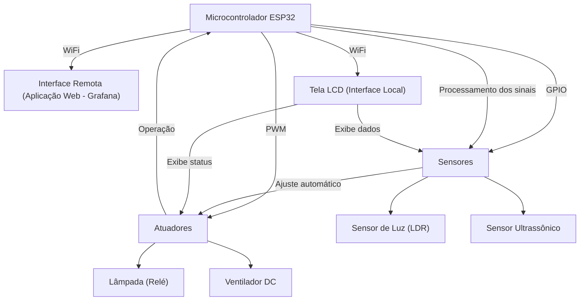

# Home-Automation-IoT
Projeto de automação residencial utilizando IoT (Internet of Things), com controle de iluminação e ventilação baseado em sensores de luz, movimento e temperatura, integrado a interfaces gráficas locais e remotas.

